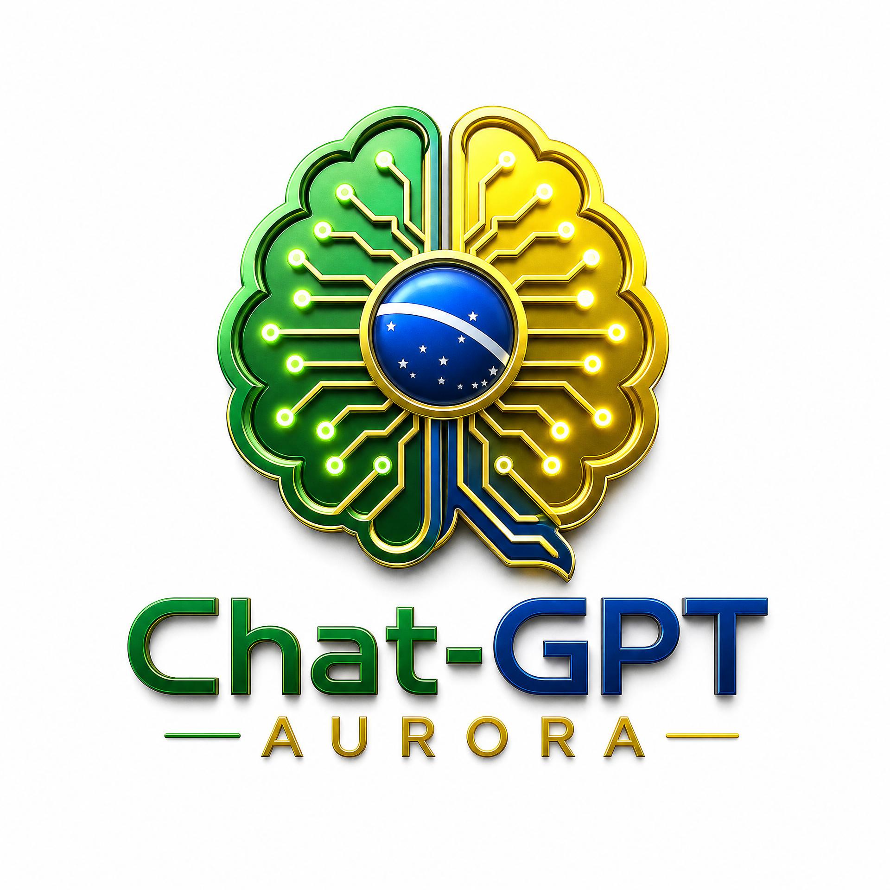

# Chat-GPT Aurora


> Uma interface de IA em português para análises, pesquisa e produtividade, pronta para execução como um **Hugging Face Space**.

## Visão do projeto

O **Chat-GPT Aurora** oferece uma interface conversacional com identidade visual brasileira, foco em clareza e mecanismos básicos de uso responsável. A aplicação foi estruturada para que a chave do provedor de IA seja lida exclusivamente dos segredos da plataforma, sem ser exposta no código-fonte, no navegador ou no histórico do repositório.

A interface é um ponto de partida para integrações que exijam governança, privacidade e transparência. A soberania efetiva dos dados depende das escolhas de modelo, infraestrutura, retenção e contratos de cada implantação; por isso, este projeto não faz alegações automáticas de residência nacional de dados.

| Camada | Implementação atual | Responsabilidade do operador |
|---|---|---|
| Interface | Gradio em português do Brasil | Personalizar identidade, políticas e fluxos de atendimento. |
| Motor de IA | API compatível com OpenAI, configurada por segredo | Escolher modelo, provedor e região compatíveis com a política de dados. |
| Credenciais | `OPENAI_API_KEY` em segredo do Space | Nunca versionar ou expor chaves em variáveis públicas. |
| Modelo | `gpt-4o-mini` por padrão, substituível por `OPENAI_MODEL` | Validar custo, capacidade e requisitos de privacidade antes do uso. |

## Execução local

Crie um ambiente virtual, instale as dependências e configure sua chave de forma local:

```bash
python -m venv .venv
source .venv/bin/activate
pip install -r requirements.txt
export OPENAI_API_KEY="sua_chave"
python app.py
```

A interface será disponibilizada no endereço informado pelo Gradio. Opcionalmente, defina `OPENAI_MODEL` para substituir o modelo padrão.

## Publicação no Hugging Face

Este repositório já inclui os metadados exigidos para um Space baseado em Gradio. Crie um Space do tipo **Gradio**, envie o conteúdo deste repositório e adicione `OPENAI_API_KEY` na área de **Settings → Secrets**. Caso queira trocar o modelo padrão, adicione também `OPENAI_MODEL` como variável de ambiente ou segredo, conforme a política de sua organização.

> **Segurança:** não envie dados pessoais, informações confidenciais, segredos corporativos ou material estratégico por esta demonstração sem uma avaliação prévia de segurança, governança e retenção de dados.

## Estrutura

```text
.
├── app.py                 # Interface Gradio pronta para o Space
├── requirements.txt       # Dependências da aplicação
├── main.py                # Função Speckle Automate original
├── assets/                # Identidade visual do projeto
└── README.md              # Metadados e instruções de execução
```

## Próximas evoluções

A aplicação pode evoluir para múltiplos provedores, autenticação, trilha de auditoria, controle de acesso por perfil e conexão com um modelo hospedado em infraestrutura própria. Essas mudanças devem ser implementadas junto com revisão de segurança e requisitos de proteção de dados.

---

**Desenvolvido por Felipe Aquino — Impulso Digital**


